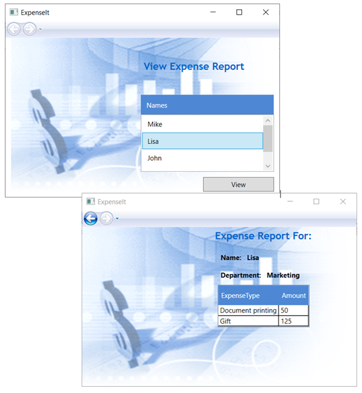

# First WPF app sample

This sample provides the code files for a starter WPF app in both C# and Visual Basic, as described in [Walkthrough: My first WPF desktop application](https://docs.microsoft.com/dotnet/framework/wpf/getting-started/walkthrough-my-first-wpf-desktop-application).

That article shows you how to develop a simple Windows Presentation Foundation (WPF) application that includes the elements that are common to most WPF applications: Extensible Application Markup Language (XAML) markup, code-behind, application definitions, controls, layout, data binding, and styles.

The walkthrough includes the following steps:

- Use XAML to design the appearance of the application's user interface (UI).

- Write code to build the application's behavior.

- Create an application definition to manage the application.

- Add controls and create the layout to compose the application UI.

- Create styles for a consistent appearance throughout an application's UI.

- Bind the UI to data to both populate the UI from data and keep the data and UI synchronized.

By the end of the walkthrough, you'll have built a standalone Windows application that allows users to view expense reports for selected people. The application is composed of several WPF pages that are hosted in a browser-style window.

## Build the sample

The easiest way to use these samples without using Git is to download the zip file containing the current version (using the link below or by clicking the "Download ZIP" button on the repo page). You can then unzip the entire archive and use the samples in [Visual Studio](https://www.visualstudio.com/wpf-vs).

### Deploying the sample

- Select **Build** > **Deploy Solution**. 

### Deploying and running the sample

- To debug the sample and then run it, press **F5** or select **Debug** > **Start Debugging**. To run the sample without debugging, press **Ctrl** + **F5** or select **Debug** > **Start Without Debugging**. 

### Preview the layout

The completed walkthrough's UI will resemble the following.

